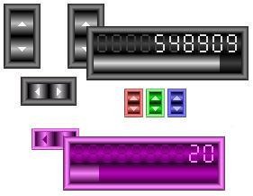



## MorphRangeRoamer v1\.02 \- Hybrid UpDown/Slider Usercontrol

### Description

(03 Mar 2007 - Added .UD_SwapDirections property; see code for explanation) MorphRangeRoamer is a different type of VB6 usercontrol that attempts to overcome the range-handling limitations of the UpDown and Slider controls by seamlessly integrating them into one small-footprint control. The idea is to provide the large range-traversing capability of the Slider as well as the precision of the UpDown in one easy-to-use graphical component. That's the theory, anyway. :) If you have any bug reports or other constructive suggestions, feel free to leave feedback, and votes are always appreciated! Enjoy.
 
### More Info
 

             |
---                |---
**Submitted On**   |2007-02-18 11:01:42
**By**             |[Option Explicit](https://github.com/Planet-Source-Code/PSCIndex/blob/master/ByAuthor/option-explicit.md)
**Level**          |Intermediate
**User Rating**    |5.0 (125 globes from 25 users)
**Compatibility**  |VB 6\.0
**Category**       |[Custom Controls/ Forms/  Menus](https://github.com/Planet-Source-Code/PSCIndex/blob/master/ByCategory/custom-controls-forms-menus__1-4.md)
**World**          |[Visual Basic](https://github.com/Planet-Source-Code/PSCIndex/blob/master/ByWorld/visual-basic.md)
**Archive File**   |[MorphRange205133332007\.zip](https://github.com/Planet-Source-Code/option-explicit-morphrangeroamer-v1-02-hybrid-updown-slider-usercontrol__1-67526/archive/master.zip)

